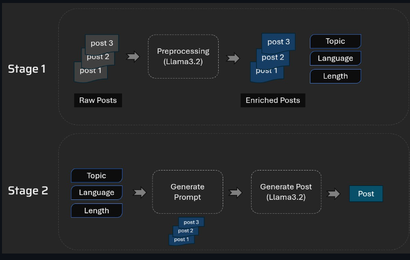

# GEN-AI-Linkedin-post-genrator
This tool will analyze posts of a LinkedIn influencer and help them create the new posts based on the writing style in their old posts

 

Let's say prasadh is a LinkedIn influencer and he needs help in writing his future posts. He can feed his past LinkedIn posts to this tool and it will extract key topics. Then he can select the topic, length, language etc. and use Generate button to create a new post that will match his writing style.
 
#Technical Architecture
 

 
Stage 1: Collect LinkedIn posts and extract Topic, Language, Length etc. from it.
Stage 2: Now use topic, language and length to generate a new post. Some of the past posts related to that specific topic, language and length will be used for few shot learning to guide the LLM about the writing style etc.
